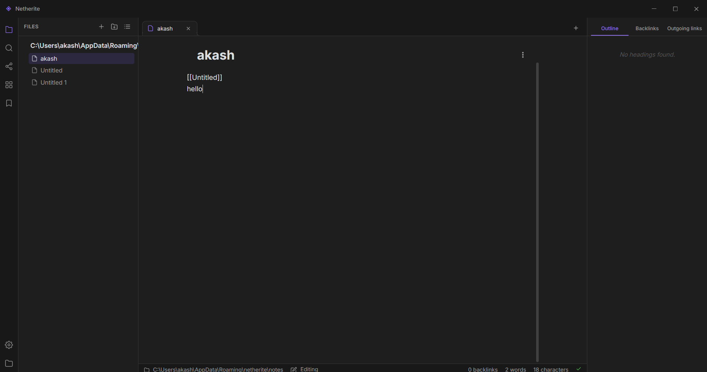
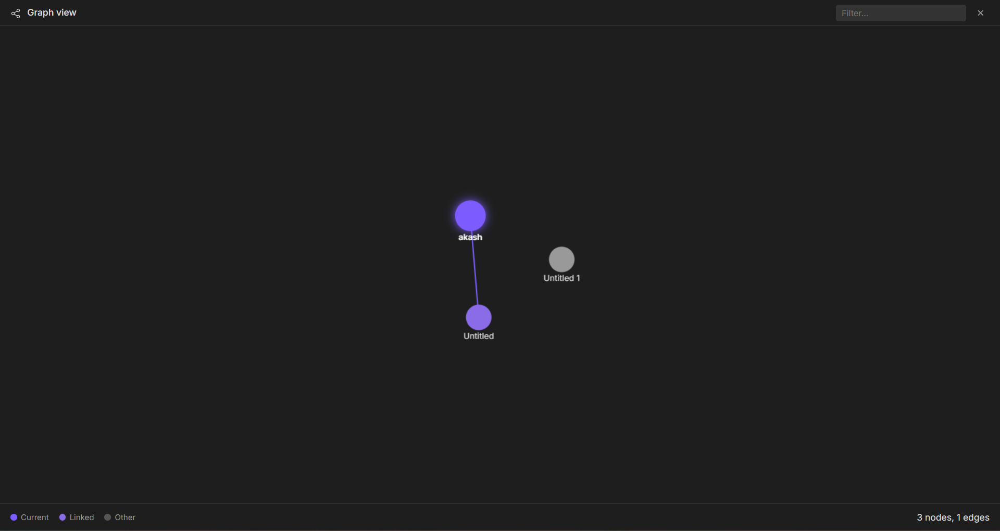
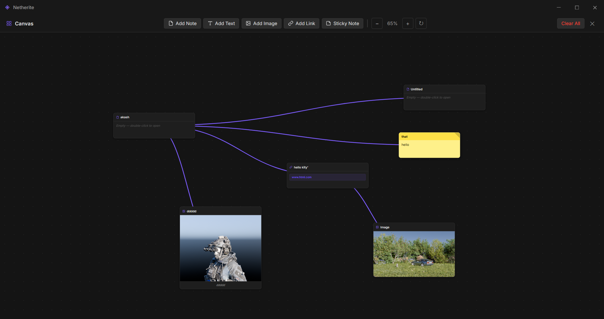

# Netherite
The application features a dynamic backlink system that connects notes using internal links, along with an interactive graph view that visualizes relationships between notes as a network. Designed with a modular architecture, the app focuses on performance, simplicity, and extensibility.

# 🧠 Netherite Notes

<p align="center">
  <b>A fast, minimal, and powerful note-taking app</b><br>
  Organize your ideas, knowledge, and workflow — fully local & distraction-free.
</p>

<p align="center">
  
  
  
  
</p>

---

## ✨ Features

* 📂 **Local-first** — your data stays on your device
* 📝 **Markdown support** — write clean and structured notes
* 🔗 **Note linking** — connect ideas together
* 🌙 **Dark mode** — smooth UI for long sessions
* ⚡ **Fast & lightweight**
* 📁 **Folder organization**
* 🔍 **Quick search**
* 💾 **Auto-save**

---

## 📸 Preview

<p align="center">
  

  

  
</p>


---

## 🛠️ Tech Stack

* ⚡ Electron
* 🎨 HTML, CSS, JavaScript
* 💾 Local storage (MD File)

---

## 🚀 Getting Started

### 🔹 Clone the repo

```bash
git clone https://github.com/your-username/netherite.git
cd netherite
```

### 🔹 Install dependencies

```bash
npm install
```

### 🔹 Run the app

```bash
npm start
```

---

## 📦 Build

```bash
npm run build
```

> Output executable will be inside `/dist` or `/build`

---

## 📁 Project Structure

```
netherite/
├── src/
│   ├── components/
│   ├── pages/
│   └── utils/
├── assets/
├── main.js
└── package.json
```

---

## 🧭 Roadmap

* [ ] Plugin system
* [ ] Sync across devices
* [ ] Graph visualization
* [ ] Themes & customization
* [ ] Mobile companion app

---

## 🤝 Contributing

Contributions are welcome!

1. Fork the repo
2. Create a new branch
3. Make your changes
4. Submit a Pull Request

---


---

## 📄 License

This project is licensed under the MIT License.

---

## ⭐ Support

If you like this project, consider giving it a ⭐ on GitHub!
